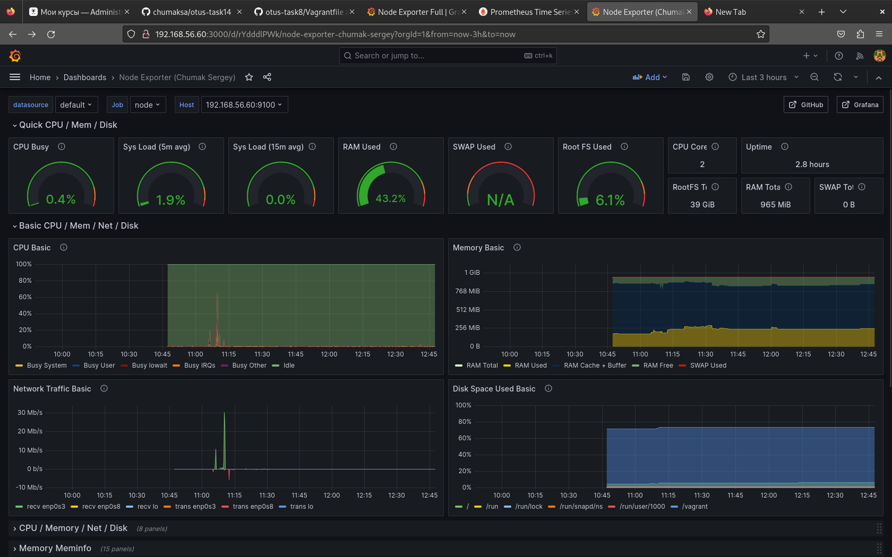

# otus-task14

# Prometheus - Grafana

Настроить дашборд с 4-мя графиками:
	* память;
	* процессор;
	* диск;
	* сеть.

В качестве результата прислать скриншот экрана - дашборд должен содержать в названии имя приславшего.

## Настроить дашборд с 4-мя графиками.

### Решение.

Для выполнения задания будем использвать VM развёрнутую с помощью Vagrant. \
В VM создадим дополнительный сетевой интерфейс. По этому IP будем обращаться к системе мониторинга с хост машины. \
Для этого будем создадим Vagrantfile следующего содержания.
```

Vagrant.configure("2") do |config|
  config.vm.box = "ubuntu/focal64"
  config.vm.define "prometheus"
  config.vm.hostname = "prometheus"
  config.vm.network "private_network", ip: "192.168.56.60"
end
```

Далее выполняем установку Prometheus. \
Выполняем установку Node exporter. \
Правим конфиг prometheus.yml.
```

global:
  scrape_interval: 15s 
  evaluation_interval: 15s 

scrape_configs:
  - job_name: "prometheus"
    static_configs:
      - targets: ["192.168.56.60:9090"]

  - job_name: "node"
    static_configs:
      - targets: ["192.168.56.60:9100"]

```

Далее устанавливаем Grafana. \
После установки Grafana будет доступна по IP - http://192.168.56.60:3000. \
Настраиваем Data sources и добавляем Dashboard Node Exporter Full (ID: 1860). \

По условиям задания нужно прислать скриншот экрана - дашборд должен содержать в названии имя приславшего. \
Скриншот экрана вместе с именем приславшего ниже:



